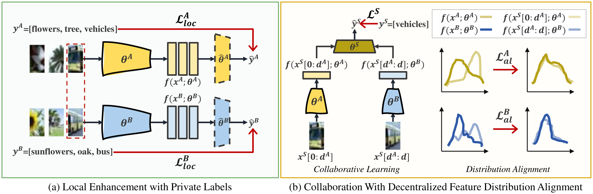

# Build Yourself Before Collaboration: Vertical Federated Learning with Limited Aligned Samples

**The official pytorch implementation of "Build Yourself Before Collaboration: Vertical Federated Learning with Limited Aligned Samples".**



> [Build Yourself Before Collaboration: Vertical Federated Learning with Limited Aligned Samples](https://ieeexplore.ieee.org/abstract/document/10896832)
> 
> Wei Shen, Mang Ye, Wei Yu, Pong C. Yuen
> 
> Wuhan University, Hong Kong Baptist University
>
> **Abstract** Vertical Federated Learning (VFL) has emerged as a crucial privacy-preserving learning paradigm that involves training models using distributed features from shared samples. However, the performance of VFL can be hindered when the number of shared or aligned samples is limited, a common issue in mobile environments where user data are diverse and unaligned across multiple devices. Existing approaches use feature generation and pseudo-label estimation for unaligned samples to address this issue, unavoidably introducing noise during the generation process. In this work, we propose Local Enhanced Effective Vertical Federated Learning (LEEF-VFL), which fully utilizes unaligned samples in the local learning before collaboration. 
Unlike previous methods that overlook private labels owned by each client, we leverage these private labels to learn from all local samples, constructing robust local models to serve as solid foundations for collaborative learning. Additionally, we reveal that the limited number of aligned samples introduces distribution bias from global data distribution. In this case, we propose to minimize the distribution discrepancies between the aligned samples and the global data distribution to enhance collaboration. Extensive experiments demonstrate the effectiveness of LEEF-VFL in addressing the challenges of limited aligned samples, making it suitable for VFL in mobile computing environments.

## Last Update

**2025/02/20** Accepted by IEEE Transactions on Mobile Computing (TMC 2025).

**2024/05/23** We have released the official codes.

## Start Guideline

- Clone repo and install requirements.txt with the anaconda environment:

```bash
conda create -n LEEF-VFL python=3.9
conda activate LEEF-VFL
git clone https://github.com/shentt67/LEEF-VFL.git
cd LEEF-VFL
pip install requirements.txt
```

- For instance, to evaluate the performance of LEEF-VFL on CIFAR10, perform:

```bash
cd ./experiments/cifar10/Ours
python main.py
```

## Citation

Please cite our work if it helps your research, thank you!

```
@article{shen2025limitedvfl,
  title={Build Yourself Before Collaboration: Vertical Federated Learning with Limited Aligned Samples},
  author={Shen, Wei and Ye, Mang and Yu, Wei and Yuen, Pong C.},
  journal={IEEE Transactions on Mobile Computing},
  year={2025}
}
```

Contact: [weishen@whu.edu.cn](mailto:weishen@whu.edu.cn)